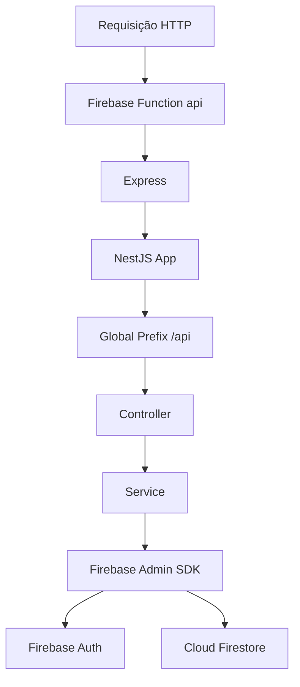
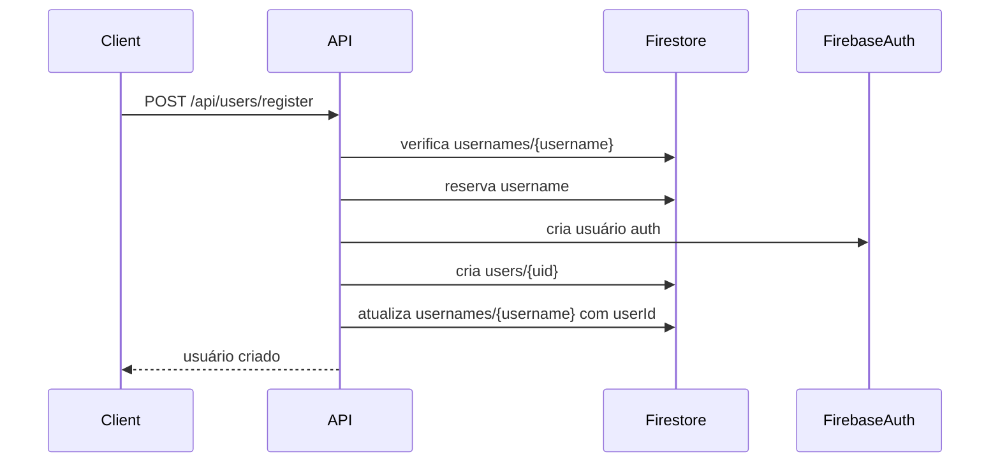
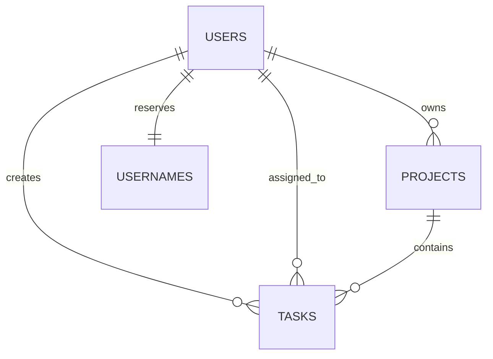

# Actrya Functions — Backend

Backend do **Actrya**, um aplicativo de organização de projetos, tarefas e fluxos de trabalho.

Este repositório contém a camada de API construída com **NestJS** rodando dentro do **Firebase Cloud Functions**, usando **Firebase Auth** para autenticação e **Cloud Firestore** como banco principal.

---

## 1. Visão geral do projeto

O Actrya nasce como um sistema de organização pessoal/profissional com foco em:

- cadastro e autenticação de usuários;
- perfil individual do usuário;
- criação de projetos;
- criação de tarefas dentro dos projetos;
- base futura para Kanban, colaboração, comentários, histórico de atividades, dashboards e camada analítica.

O backend atual está estruturado para ser usado por um frontend web ou mobile. Todas as rotas principais passam pelo prefixo global `/api`, definido na inicialização do NestJS.

Exemplo de rota real:

```txt
/api/users/register
/api/auth/login
/api/projects
/api/projects/:projectId/tasks
```

---

## 2. Stack técnica

### Linguagem e runtime

- **TypeScript**
- **Node.js**
- **Express**
- **NestJS**

### Infraestrutura

- **Firebase Functions v2**
- **Firebase Admin SDK**
- **Firebase Auth**
- **Cloud Firestore**

### Validação

- **class-validator**
- **class-transformer**
- `ValidationPipe` global do NestJS

---

## 3. Arquitetura geral

O backend segue uma arquitetura modular do NestJS:

```txt
src/
  app.module.ts
  main.ts
  index.ts

  auth/
    auth.controller.ts
    auth.service.ts
    auth.module.ts
    firebase-auth.guard.ts
    auth-user.interface.ts
    dto/
      login.dto.ts

  firebase/
    firebase.module.ts
    firebase.service.ts

  health/
    health.controller.ts
    health.module.ts

  users/
    users.controller.ts
    users.service.ts
    users.module.ts
    dto/
      register-user.dto.ts
      update-user.dto.ts
      update-password.dto.ts

  projects/
    projects.controller.ts
    projects.service.ts
    projects.module.ts
    dto/
      create-project.dto.ts
      update-project.dto.ts

  tasks/
    tasks.controller.ts
    tasks.service.ts
    tasks.module.ts
    dto/
      create-task.dto.ts
      update-task.dto.ts
```

---

## 4. Fluxo de execução da API

A aplicação funciona da seguinte forma:



O arquivo `index.ts` exporta a função HTTP chamada `api`. Essa função cria ou reutiliza o servidor NestJS.

O arquivo `main.ts` cria o Express, conecta o NestJS por meio do `ExpressAdapter`, ativa CORS, define o prefixo `/api` e aplica validação global.

---

## 5. Módulos atuais

### 5.1 `AppModule`

O `AppModule` é o módulo raiz da aplicação. Ele conecta os módulos principais do sistema.

Atualmente importa:

```ts
FirebaseModule
HealthModule
UsersModule
AuthModule
ProjectsModule
TasksModule
```

Isso significa que o backend já possui:

- infraestrutura Firebase;
- rota de saúde;
- autenticação;
- gestão de usuários;
- gestão de projetos;
- gestão de tarefas.

---

### 5.2 `FirebaseModule` e `FirebaseService`

O `FirebaseService` centraliza o acesso ao Firebase Admin SDK.

Ele expõe dois recursos principais:

```ts
firebaseService.auth
firebaseService.firestore
```

Uso atual:

- `auth`: criar usuários, atualizar senha, desativar conta e verificar tokens;
- `firestore`: gravar e consultar usuários, usernames, projetos e tarefas.

Essa centralização evita inicializar o Firebase Admin em vários lugares diferentes.

---

### 5.3 `AuthModule`

Responsável pelo login e pela proteção de rotas autenticadas.

Componentes principais:

```txt
auth.controller.ts
auth.service.ts
firebase-auth.guard.ts
```

#### Login

Rota:

```txt
POST /api/auth/login
```

Body esperado:

```json
{
  "email": "usuario@email.com",
  "password": "senha"
}
```

Resposta esperada:

```json
{
  "message": "Login realizado com sucesso.",
  "tokenType": "Bearer",
  "idToken": "TOKEN_DO_FIREBASE",
  "refreshToken": "REFRESH_TOKEN",
  "expiresIn": "3600",
  "user": {
    "id": "uid",
    "email": "usuario@email.com"
  }
}
```

O login usa a API do Firebase Identity Toolkit. Em ambiente local, se `FIREBASE_AUTH_EMULATOR_HOST` estiver configurado, o serviço usa o emulador de autenticação.

#### Proteção de rotas

O `FirebaseAuthGuard` espera um cabeçalho:

```txt
Authorization: Bearer <idToken>
```

O guard:

1. verifica se o token existe;
2. remove o prefixo `Bearer`;
3. valida o token usando Firebase Admin;
4. injeta `request.user` com:

```ts
{
  uid: decodedToken.uid,
  email: decodedToken.email
}
```

Isso permite que controllers e services saibam quem é o usuário autenticado.

---

### 5.4 `UsersModule`

Responsável pelo cadastro, consulta, atualização e desativação de usuários.

Rotas:

```txt
POST   /api/users/register
GET    /api/users/me
PATCH  /api/users/me
PATCH  /api/users/me/password
DELETE /api/users/me
```

#### `POST /api/users/register`

Cria um novo usuário no Firebase Auth e um perfil no Firestore.

Fluxo:



Coleções afetadas:

```txt
users
usernames
Firebase Auth
```

Perfil criado em `users/{uid}`:

```ts
{
  id: string,
  name: string,
  username: string,
  email: string,
  role: "user",
  status: "active",
  theme: "dark",
  onboardingCompleted: false,
  createdAt: Date,
  updatedAt: Date
}
```

Reserva de username em `usernames/{username}`:

```ts
{
  username: string,
  reservedAt: Date,
  userId?: string,
  email?: string,
  confirmedAt?: Date
}
```

A coleção `usernames` funciona como índice de unicidade. Como Firestore não possui constraint única nativa como SQL, essa coleção evita dois usuários com o mesmo username.

#### `GET /api/users/me`

Retorna o perfil do usuário autenticado.

Requer token Bearer.

#### `PATCH /api/users/me`

Atualiza dados do perfil.

Campos possíveis:

```ts
name?: string
username?: string
theme?: string
```

Se o nome for alterado, também atualiza o `displayName` no Firebase Auth.

Se o username for alterado:

1. verifica se o novo username existe;
2. cria novo registro em `usernames`;
3. remove o username antigo;
4. atualiza o perfil do usuário.

#### `PATCH /api/users/me/password`

Atualiza a senha do usuário no Firebase Auth.

#### `DELETE /api/users/me`

Não apaga fisicamente o usuário. Ele faz soft delete:

- define `status: "inactive"` no Firestore;
- desativa o usuário no Firebase Auth com `disabled: true`.

Isso é melhor do que apagar, porque preserva histórico, projetos e rastreabilidade futura.

---

### 5.5 `ProjectsModule`

Responsável por criar e gerenciar projetos.

Rotas:

```txt
POST   /api/projects
GET    /api/projects
GET    /api/projects/:projectId
PATCH  /api/projects/:projectId
DELETE /api/projects/:projectId
```

Todas as rotas são protegidas por `FirebaseAuthGuard`.

#### Modelo atual da coleção `projects`

```ts
{
  id?: string,
  name: string,
  description: string,
  color: string,
  status: "active" | "paused" | "completed" | "archived",
  ownerId: string,
  memberIds: string[],
  createdAt: Date,
  updatedAt: Date,
  archivedAt?: Date
}
```

#### `POST /api/projects`

Cria um projeto.

Body exemplo:

```json
{
  "name": "Organizar Actrya",
  "description": "Projeto para estruturar backend e frontend do app.",
  "color": "#7C3AED",
  "status": "active"
}
```

O backend define automaticamente:

```ts
ownerId = request.user.uid
memberIds = [request.user.uid]
createdAt = now
updatedAt = now
```

#### `GET /api/projects`

Lista os projetos onde o usuário autenticado aparece em `memberIds`.

Consulta usada:

```ts
where("memberIds", "array-contains", userId)
orderBy("updatedAt", "desc")
```

Isso permite que futuramente um projeto tenha vários membros.

#### `GET /api/projects/:projectId`

Busca um projeto específico, mas só retorna se o usuário autenticado estiver em `memberIds`.

#### `PATCH /api/projects/:projectId`

Atualiza projeto.

Regra atual:

- apenas o `ownerId` pode editar.

Campos editáveis:

```ts
name
description
color
status
```

#### `DELETE /api/projects/:projectId`

Arquiva o projeto.

Não apaga fisicamente.

Atualiza:

```ts
status: "archived"
archivedAt: Date
updatedAt: Date
```

---

### 5.6 `TasksModule`

Responsável por criar e gerenciar tarefas dentro dos projetos.

Rotas:

```txt
POST   /api/projects/:projectId/tasks
GET    /api/projects/:projectId/tasks
GET    /api/tasks/:taskId
PATCH  /api/tasks/:taskId
DELETE /api/tasks/:taskId
```

Todas as rotas são protegidas por `FirebaseAuthGuard`.

#### Modelo atual da coleção `tasks`

```ts
{
  id?: string,
  projectId: string,
  title: string,
  description: string,
  status: "todo" | "doing" | "done" | "archived",
  priority: "low" | "medium" | "high" | "urgent",
  assigneeId: string,
  ownerId: string,
  dueDate: string | null,
  order: number,
  createdAt: Date,
  updatedAt: Date,
  archivedAt?: Date
}
```

#### `POST /api/projects/:projectId/tasks`

Cria uma tarefa dentro de um projeto.

Antes de criar a tarefa, o backend valida se o usuário tem acesso ao projeto.

Body exemplo:

```json
{
  "title": "Criar README técnico",
  "description": "Documentar arquitetura, rotas, coleções e evolução.",
  "status": "todo",
  "priority": "high",
  "dueDate": "2026-05-25",
  "order": 0
}
```

Campos automáticos:

```ts
projectId = params.projectId
ownerId = request.user.uid
assigneeId = dto.assigneeId ?? request.user.uid
createdAt = now
updatedAt = now
```

Depois de criar a tarefa, o projeto recebe novo `updatedAt`, para aparecer mais acima na listagem de projetos.

#### `GET /api/projects/:projectId/tasks`

Lista tarefas de um projeto.

Antes de listar, valida acesso ao projeto.

Ordenação atual:

```ts
orderBy("order", "asc")
orderBy("createdAt", "asc")
```

Isso prepara o backend para um Kanban visual, onde `order` define a posição da tarefa na coluna.

#### `GET /api/tasks/:taskId`

Busca uma tarefa específica.

Fluxo:

1. busca a tarefa;
2. lê `projectId` da tarefa;
3. valida se o usuário tem acesso ao projeto;
4. retorna a tarefa.

#### `PATCH /api/tasks/:taskId`

Atualiza uma tarefa.

Campos editáveis:

```ts
title
description
status
priority
assigneeId
dueDate
order
```

Depois da atualização, também atualiza `updatedAt` do projeto.

#### `DELETE /api/tasks/:taskId`

Arquiva a tarefa.

Não apaga fisicamente.

Atualiza:

```ts
status: "archived"
archivedAt: Date
updatedAt: Date
```

Também atualiza `updatedAt` do projeto pai.

---

## 6. Relações entre coleções

O Firestore não é relacional como PostgreSQL ou MySQL. Mesmo assim, o backend usa referências lógicas entre coleções.

### Coleções atuais

```txt
users
usernames
projects
tasks
```

### Relações atuais



### Explicação das relações

#### `users` -> `projects`

Um usuário pode ser dono de vários projetos.

Campo em `projects`:

```ts
ownerId: string
```

#### `users` -> `projects.memberIds`

Um usuário pode participar de vários projetos.

Campo em `projects`:

```ts
memberIds: string[]
```

Essa estrutura permite colaboração futura.

#### `projects` -> `tasks`

Um projeto pode ter várias tarefas.

Campo em `tasks`:

```ts
projectId: string
```

#### `users` -> `tasks.ownerId`

O campo `ownerId` da tarefa indica quem criou a tarefa.

#### `users` -> `tasks.assigneeId`

O campo `assigneeId` indica quem está responsável pela tarefa.

Por enquanto, a API não valida se o `assigneeId` pertence ao projeto. Isso é um ponto importante de evolução.

#### `users` -> `usernames`

A coleção `usernames` protege a unicidade de nomes de usuário.

---

## 7. Modelo atual do banco

### 7.1 Coleção `users`

Finalidade: armazenar perfil de usuário usado pelo app.

Documento:

```txt
users/{uid}
```

Campos:

| Campo | Tipo | Descrição |
|---|---|---|
| `id` | string | UID do Firebase Auth |
| `name` | string | Nome visível do usuário |
| `username` | string | Nome único de usuário |
| `email` | string | E-mail normalizado |
| `role` | string | Perfil de permissão. Hoje: `user` |
| `status` | string | Estado da conta: `active` ou `inactive` |
| `theme` | string | Tema visual preferido |
| `onboardingCompleted` | boolean | Indica se concluiu onboarding |
| `createdAt` | Date | Data de criação |
| `updatedAt` | Date | Data da última atualização |

---

### 7.2 Coleção `usernames`

Finalidade: funcionar como índice de unicidade para username.

Documento:

```txt
usernames/{username}
```

Campos:

| Campo | Tipo | Descrição |
|---|---|---|
| `username` | string | Username normalizado |
| `reservedAt` | Date | Momento em que foi reservado |
| `userId` | string | Usuário dono do username |
| `email` | string | E-mail do usuário |
| `confirmedAt` | Date | Momento da confirmação |

Observação: durante o cadastro, o username é reservado antes da criação do usuário no Auth. Se algo falhar, o backend tenta remover a reserva.

---

### 7.3 Coleção `projects`

Finalidade: armazenar projetos do usuário.

Documento:

```txt
projects/{projectId}
```

Campos:

| Campo | Tipo | Descrição |
|---|---|---|
| `name` | string | Nome do projeto |
| `description` | string | Descrição do projeto |
| `color` | string | Cor visual do projeto |
| `status` | string | `active`, `paused`, `completed`, `archived` |
| `ownerId` | string | UID do dono |
| `memberIds` | string[] | Lista de usuários com acesso |
| `createdAt` | Date | Criação |
| `updatedAt` | Date | Última alteração |
| `archivedAt` | Date | Data de arquivamento, se houver |

---

### 7.4 Coleção `tasks`

Finalidade: armazenar tarefas associadas a projetos.

Documento:

```txt
tasks/{taskId}
```

Campos:

| Campo | Tipo | Descrição |
|---|---|---|
| `projectId` | string | Projeto ao qual a tarefa pertence |
| `title` | string | Título da tarefa |
| `description` | string | Descrição da tarefa |
| `status` | string | `todo`, `doing`, `done`, `archived` |
| `priority` | string | `low`, `medium`, `high`, `urgent` |
| `assigneeId` | string | Responsável pela tarefa |
| `ownerId` | string | Usuário que criou a tarefa |
| `dueDate` | string/null | Prazo da tarefa |
| `order` | number | Ordem visual no Kanban |
| `createdAt` | Date | Criação |
| `updatedAt` | Date | Última alteração |
| `archivedAt` | Date | Data de arquivamento, se houver |

---

## 8. A estrutura atual respeita star schema?

Resposta curta: **não exatamente**.

Resposta correta: o backend atual está estruturado como um **modelo operacional de aplicação**, não como um **star schema analítico**.

Isso não é um erro. É uma decisão natural para a fase atual do produto.

### 8.1 O que é star schema?

Star schema é um modelo dimensional usado principalmente para análise de dados, BI e data warehouse.

Normalmente ele possui:

- uma tabela fato central;
- várias tabelas dimensão ao redor.

Exemplo:

```txt
                 dim_users
                     |
dim_projects --- fact_tasks --- dim_dates
                     |
                dim_status
                     |
               dim_priority
```

A tabela fato guarda os eventos ou medidas principais. As dimensões guardam os contextos de análise.

### 8.2 Por que o backend atual não é star schema?

Porque as coleções atuais foram modeladas para operação do app:

```txt
users
projects
tasks
usernames
```

Elas respondem perguntas como:

- Quem é o usuário logado?
- Quais projetos ele pode acessar?
- Quais tarefas pertencem a este projeto?
- Qual tarefa deve ser atualizada?

Isso é uma modelagem de produto/aplicação, mais próxima de um modelo **OLTP**.

### 8.3 O que há de parecido com star schema?

A coleção `tasks` pode futuramente virar uma espécie de fato operacional, porque cada tarefa representa um objeto mensurável.

Ela possui chaves para dimensões:

```ts
projectId
ownerId
assigneeId
status
priority
dueDate
createdAt
updatedAt
```

Esses campos permitem análises como:

- tarefas por projeto;
- tarefas por status;
- tarefas por prioridade;
- tarefas por responsável;
- tarefas criadas por período;
- tarefas concluídas por período;
- tempo médio até conclusão.

Mas ainda não existe uma camada dimensional explícita.

### 8.4 Como ficaria uma camada star schema futura?

Uma camada analítica futura poderia ser criada separadamente, sem prejudicar o Firestore operacional.

Sugestão:

```txt
analytics_fact_tasks
analytics_dim_users
analytics_dim_projects
analytics_dim_dates
analytics_dim_status
analytics_dim_priority
```

#### `analytics_fact_tasks`

```ts
{
  taskId: string,
  projectId: string,
  ownerId: string,
  assigneeId: string,
  statusKey: string,
  priorityKey: string,
  createdDateKey: string,
  dueDateKey: string | null,
  completedDateKey: string | null,
  cycleTimeHours: number | null,
  isArchived: boolean,
  isOverdue: boolean,
  createdAt: Date,
  updatedAt: Date
}
```

#### `analytics_dim_projects`

```ts
{
  projectId: string,
  name: string,
  ownerId: string,
  status: string,
  createdAt: Date
}
```

#### `analytics_dim_users`

```ts
{
  userId: string,
  name: string,
  username: string,
  email: string,
  role: string,
  status: string
}
```

#### `analytics_dim_dates`

```ts
{
  dateKey: string,
  date: string,
  year: number,
  month: number,
  monthName: string,
  quarter: number,
  week: number,
  dayOfWeek: string
}
```

### 8.5 Recomendação sobre star schema

Para o momento atual, a recomendação é:

1. manter o modelo operacional simples;
2. garantir consistência entre projetos e tarefas;
3. registrar histórico de eventos;
4. depois criar uma camada analítica separada.

Não é recomendado forçar star schema diretamente no Firestore transacional agora, porque isso pode deixar o app mais complexo antes da hora.

O ideal é pensar em duas camadas:

```txt
Camada operacional:
users, projects, tasks, comments, activityLogs

Camada analítica futura:
fact_tasks, fact_project_activity, dim_users, dim_projects, dim_dates
```

---

## 9. Pontos fortes da estrutura atual

### 9.1 Separação modular

Cada domínio tem seu próprio módulo:

```txt
AuthModule
UsersModule
ProjectsModule
TasksModule
FirebaseModule
```

Isso facilita manutenção.

---

### 9.2 Guard centralizado

A autenticação não fica repetida dentro de cada rota.

O `FirebaseAuthGuard` centraliza:

- leitura do token;
- validação do token;
- injeção do usuário autenticado.

---

### 9.3 Soft delete

Projetos e tarefas são arquivados, não apagados.

Isso permite:

- recuperação futura;
- auditoria;
- histórico;
- métricas reais.

---

### 9.4 Estrutura pronta para colaboração

Mesmo que hoje os projetos sejam individuais, o campo `memberIds` já prepara o backend para equipes.

---

### 9.5 Tarefas já preparadas para Kanban

Os campos abaixo já permitem montar um Kanban:

```ts
status
order
priority
assigneeId
```

---

## 10. Pontos de atenção

### 10.1 Validação de `assigneeId`

Hoje, ao criar ou editar uma tarefa, o backend aceita `assigneeId`, mas ainda não valida se esse usuário pertence ao projeto.

Evolução recomendada:

```txt
Se assigneeId for informado, verificar se ele está em project.memberIds.
```

---

### 10.2 Índices compostos no Firestore

Algumas consultas podem exigir índices compostos.

Exemplo:

```ts
where("projectId", "==", projectId)
orderBy("order", "asc")
orderBy("createdAt", "asc")
```

Se o Firestore reclamar, será necessário criar o índice sugerido no console do Firebase.

---

### 10.3 Atualização de username não usa transação

A troca de username faz múltiplas operações:

1. verifica novo username;
2. cria novo username;
3. apaga antigo;
4. atualiza usuário.

Para maior segurança contra concorrência, futuramente isso pode virar uma transação Firestore.

---

### 10.4 Criação de projeto e tarefa não registra atividade

Hoje o sistema cria os dados principais, mas não grava histórico de eventos.

Futuro ideal:

```txt
activityLogs
```

Com eventos como:

```txt
PROJECT_CREATED
TASK_CREATED
TASK_STATUS_CHANGED
TASK_ASSIGNED
TASK_ARCHIVED
```

---

### 10.5 Ausência de roles por projeto

Hoje existe apenas:

```ts
ownerId
memberIds
```

Futuramente pode existir:

```txt
projectMembers
```

Com papéis:

```ts
owner
admin
editor
viewer
```

---

## 11. Evoluções recomendadas

### Fase 1 — Consolidar backend atual

- testar cadastro;
- testar login;
- testar criação de projeto;
- testar criação de tarefa;
- testar atualização de status da tarefa;
- testar arquivamento.

---

### Fase 2 — Melhorar segurança e consistência

- validar `assigneeId` contra `memberIds`;
- usar transações em username;
- impedir edição de projeto arquivado;
- impedir criação de tarefa em projeto arquivado;
- criar tratamento padronizado de erros;
- criar logs de auditoria.

---

### Fase 3 — Colaboração

Criar coleção:

```txt
projectMembers
```

Modelo sugerido:

```ts
{
  projectId: string,
  userId: string,
  role: "owner" | "admin" | "editor" | "viewer",
  status: "active" | "invited" | "removed",
  invitedBy: string,
  joinedAt?: Date,
  createdAt: Date,
  updatedAt: Date
}
```

Rotas futuras:

```txt
POST   /api/projects/:projectId/members
GET    /api/projects/:projectId/members
PATCH  /api/projects/:projectId/members/:userId
DELETE /api/projects/:projectId/members/:userId
```

---

### Fase 4 — Comentários em tarefas

Criar coleção:

```txt
taskComments
```

Modelo sugerido:

```ts
{
  taskId: string,
  projectId: string,
  authorId: string,
  content: string,
  createdAt: Date,
  updatedAt: Date,
  deletedAt?: Date
}
```

Rotas futuras:

```txt
POST   /api/tasks/:taskId/comments
GET    /api/tasks/:taskId/comments
PATCH  /api/comments/:commentId
DELETE /api/comments/:commentId
```

---

### Fase 5 — Activity log

Criar coleção:

```txt
activityLogs
```

Modelo sugerido:

```ts
{
  projectId: string,
  taskId?: string,
  actorId: string,
  action: string,
  entityType: "project" | "task" | "comment" | "member",
  entityId: string,
  before?: Record<string, unknown>,
  after?: Record<string, unknown>,
  createdAt: Date
}
```

Essa coleção será essencial para:

- auditoria;
- timeline do projeto;
- notificações;
- métricas futuras;
- reconstrução de eventos.

---

### Fase 6 — Kanban real

Hoje o status da tarefa funciona como coluna:

```txt
todo
doing
done
archived
```

Para um Kanban mais flexível, pode existir a coleção:

```txt
projectColumns
```

Modelo sugerido:

```ts
{
  projectId: string,
  name: string,
  key: string,
  order: number,
  color: string,
  isFinal: boolean,
  createdAt: Date,
  updatedAt: Date
}
```

Assim cada projeto poderia ter colunas personalizadas.

---

### Fase 7 — Analytics / Star Schema

Quando o produto já tiver uso real, criar uma camada analítica.

Opções:

1. manter coleções analíticas no próprio Firestore;
2. exportar para BigQuery;
3. criar jobs de sincronização;
4. criar dashboards no frontend usando agregações pré-calculadas.

Coleções analíticas sugeridas:

```txt
analytics_fact_tasks
analytics_fact_project_activity
analytics_dim_users
analytics_dim_projects
analytics_dim_dates
analytics_dim_status
analytics_dim_priority
```

---

## 12. Roadmap técnico sugerido

### Agora

```txt
1. Testar backend localmente
2. Garantir build sem erro
3. Criar dados reais no emulador
4. Validar fluxo usuário -> projeto -> tarefa
```

### Depois

```txt
5. Criar frontend
6. Criar tela de login/cadastro
7. Criar dashboard de projetos
8. Criar tela de detalhes do projeto
9. Criar Kanban simples usando status da tarefa
```

### Depois do MVP

```txt
10. Adicionar membros
11. Adicionar comentários
12. Adicionar activity logs
13. Adicionar notificações
14. Adicionar analytics
15. Melhorar modelagem dimensional
```

---

## 13. Testes manuais sugeridos

### 13.1 Cadastro

```http
POST /api/users/register
Content-Type: application/json

{
  "name": "Drielly",
  "username": "drielly",
  "email": "drielly@email.com",
  "password": "SenhaSegura123"
}
```

### 13.2 Login

```http
POST /api/auth/login
Content-Type: application/json

{
  "email": "drielly@email.com",
  "password": "SenhaSegura123"
}
```

Copiar o `idToken` retornado.

### 13.3 Buscar meu perfil

```http
GET /api/users/me
Authorization: Bearer <idToken>
```

### 13.4 Criar projeto

```http
POST /api/projects
Authorization: Bearer <idToken>
Content-Type: application/json

{
  "name": "Actrya Backend",
  "description": "Organização da API do Actrya.",
  "color": "#7C3AED"
}
```

### 13.5 Listar projetos

```http
GET /api/projects
Authorization: Bearer <idToken>
```

### 13.6 Criar tarefa

```http
POST /api/projects/<projectId>/tasks
Authorization: Bearer <idToken>
Content-Type: application/json

{
  "title": "Criar README técnico",
  "description": "Explicar toda a estrutura do backend.",
  "priority": "high",
  "status": "todo",
  "order": 0
}
```

### 13.7 Listar tarefas do projeto

```http
GET /api/projects/<projectId>/tasks
Authorization: Bearer <idToken>
```

### 13.8 Mover tarefa no Kanban

```http
PATCH /api/tasks/<taskId>
Authorization: Bearer <idToken>
Content-Type: application/json

{
  "status": "doing",
  "order": 1
}
```

---

## 14. Comandos úteis

### Instalar dependências

```bash
npm install
```

### Build

```bash
npm run build
```

### Rodar emulador de Functions

```bash
npm run serve
```

### Deploy

```bash
npm run deploy
```

### Logs

```bash
npm run logs
```

---

## 15. Variáveis de ambiente

### `FIREBASE_WEB_API_KEY`

Necessária para login via Firebase Identity Toolkit.

Sem ela, o endpoint `/api/auth/login` retorna erro informando que a chave não está configurada.

### `FIREBASE_AUTH_EMULATOR_HOST`

Usada para redirecionar login para o emulador local de autenticação.

Exemplo:

```txt
127.0.0.1:9099
```

---

## 16. Decisões técnicas importantes

### 16.1 Soft delete em vez de delete real

Projetos e tarefas são arquivados. Isso preserva histórico e evita perda acidental.

### 16.2 Firestore com referências por ID

O backend usa IDs como `ownerId`, `projectId` e `assigneeId` em vez de subcoleções aninhadas para tarefas.

Isso facilita consultas globais futuras, por exemplo:

```txt
Todas as tarefas atribuídas a um usuário
Todas as tarefas atrasadas
Todas as tarefas de prioridade urgente
```

### 16.3 `memberIds` no projeto

Mesmo que o MVP seja individual, o projeto já está preparado para colaboração.

### 16.4 `order` na tarefa

Esse campo prepara a ordenação visual do Kanban.

### 16.5 `updatedAt` do projeto muda quando tarefa muda

Isso faz sentido para a tela de projetos, porque um projeto com tarefa recente deve aparecer como atualizado.

---

## 17. O que ainda falta para um MVP funcional

Backend:

- validar `assigneeId`;
- impedir ação em projeto arquivado;
- criar logs de atividade;
- criar testes automatizados;
- melhorar respostas padronizadas;
- criar documentação Swagger/OpenAPI.

Frontend:

- login;
- cadastro;
- dashboard;
- lista de projetos;
- criação de projeto;
- tela de projeto;
- Kanban simples;
- criação/edição de tarefas;
- perfil do usuário.

Infraestrutura:

- configurar variáveis de ambiente de produção;
- configurar Firebase Hosting ou outro frontend host;
- configurar regras de Firestore;
- configurar deploy contínuo futuramente.

---

## 18. Resumo do estado atual

```txt
✅ Firebase Functions configurado
✅ NestJS configurado
✅ Firebase Admin centralizado
✅ Auth/login implementado
✅ Guard de autenticação implementado
✅ Cadastro de usuário implementado
✅ Perfil de usuário implementado
✅ Projetos implementados
✅ Tarefas implementadas
✅ Modelo inicial pronto para Kanban
⚠️ Star schema ainda não implementado, mas há caminho claro para camada analítica
⚠️ Colaboração ainda parcial: memberIds existe, mas roles e convites ainda não
⚠️ Ainda falta frontend
```

---

## 19. Próxima melhor tarefa

A próxima implementação recomendada no backend é validar se o `assigneeId` informado em uma tarefa pertence ao projeto.

Depois disso, a melhor evolução é criar `activityLogs`, porque ela dará base para:

- histórico do projeto;
- notificações;
- auditoria;
- métricas;
- futura tabela fato analítica.

---

## 20. Glossário rápido

| Termo | Significado |
|---|---|
| `uid` | ID do usuário no Firebase Auth |
| `ownerId` | Usuário dono de um recurso |
| `memberIds` | Usuários que têm acesso a um projeto |
| `assigneeId` | Usuário responsável por uma tarefa |
| `soft delete` | Arquivar em vez de apagar |
| `OLTP` | Modelo operacional para uso diário do app |
| `OLAP` | Modelo analítico para BI e relatórios |
| `star schema` | Modelo dimensional com fato central e dimensões |
| `fact table` | Tabela/coleção de eventos ou medidas |
| `dimension table` | Tabela/coleção de contexto analítico |
